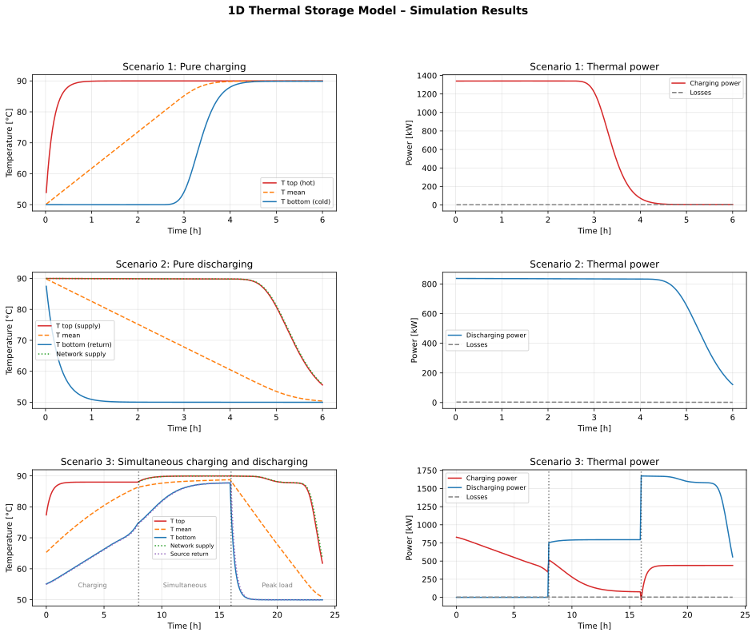
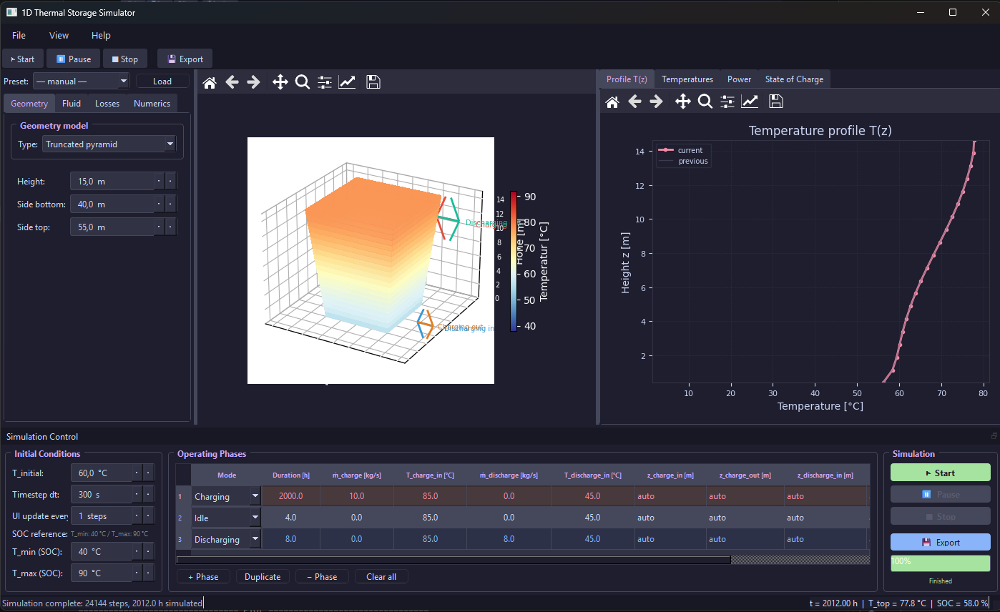

# thermal-energy-storage-1d

A 1D finite-volume model of a stratified hot-water thermal energy storage (TES) tank, designed for coupling with district heating network simulation tools.



## Features

- **1D stratification model** — N vertical nodes, energy balance with advection, conduction, and heat loss
- **Advection schemes** — Upwind (1st order) and TVD van Leer (2nd order, default)
- **Solvers** — Explicit Euler (CFL-limited, auto sub-stepping) and Implicit Euler (TDMA, unconditionally stable)
- **Buoyancy / convective adjustment** — caloric mixing after each timestep, O(N)
- **Flexible port system** — arbitrary number of hydraulic ports at configurable heights with diffusor models (PointDiffusor, UniformDiffusor)
- **Heat exchanger port** — ε-NTU indirect heat transfer without mass exchange
- **Geometry models** — CylinderGeometry, TruncatedConeGeometry, TruncatedPyramidGeometry
- **Loss models** — ConstantAmbientLoss, SplitAmbientLoss (lid vs. wall), GroundTemperatureLoss, TransientGroundLoss
- **Temperature-dependent fluid properties** — WaterProperties (polynomial fits matching FreeTTES)
- **Headspace model** — dynamic roof/gas space thermal mass (for atmospheric pit stores)
- **Storage presets** — StoragePresets factory for common configurations
- **Interactive UI** — PyQt6 GUI with 3D tank visualisation and live plots
- **FMI 2.0 interface** — planned co-simulation coupling via pythonfmu

## Requirements

```
numpy>=1.20
matplotlib>=3.4
```

Install:

```bash
pip install -r requirements.txt
```

For the interactive UI additionally:

```bash
pip install -r requirements_ui.txt   # PyQt6, pyqtgraph, PyOpenGL
```

## Quick Start

```python
from thermal_energy_storage_model import StorageConfig, StorageInputs, ThermalStorage1D

config = StorageConfig(
    volume=100.0,    # m³
    height=5.0,      # m
    n_nodes=20,
    U_loss=0.3,      # W/(m²·K)
    T_ambient=10.0,  # °C
)
storage = ThermalStorage1D(config)
state = storage.initialize(T_init=60.0)  # °C, uniform

inputs = StorageInputs.two_port(
    m_dot_charge=5.0,     # kg/s
    T_charge_in=85.0,     # °C
    height=config.height,
)
outputs = storage.step(state, dt=3600.0, inputs=inputs)
print(f"Outlet: {outputs.port_temperatures[1]:.1f} °C")
```

See [examples/example_simulation.py](examples/example_simulation.py) for a complete three-phase scenario (charging / idle / discharging).

## Interactive UI

```bash
python run_ui.py
```



The UI lets you configure storage geometry, loss parameters, solver settings, and port positions interactively, with a live 3D view and real-time temperature profile and outlet-temperature plots.

## Repository Structure

```
thermal-energy-storage-1d/
├── thermal_energy_storage_model/  # Modular Python package (core model)
│   ├── __init__.py                # Public API re-exports
│   ├── config.py                  # StorageConfig
│   ├── state.py                   # StorageState, StorageInputs, StorageOutputs
│   ├── geometry.py                # CylinderGeometry, TruncatedConeGeometry, …
│   ├── fluids.py                  # WaterProperties, ConstantFluidProperties
│   ├── losses.py                  # ConstantAmbientLoss, GroundTemperatureLoss, …
│   ├── ports.py                   # Port, HeatExchangerPort
│   ├── diffusors.py               # PointDiffusor, UniformDiffusor
│   ├── solver.py                  # Explicit/Implicit Euler solvers
│   ├── model.py                   # ThermalStorage1D (main class)
│   └── presets.py                 # StoragePresets factory
├── run_ui.py                      # UI entry point
├── ui/                            # PyQt6 UI components
├── examples/
│   ├── example_simulation.py      # Three-phase example
│   └── simulation_results.svg
├── benchmark/
│   ├── config_benchmark.py        # Shared tank parameters
│   ├── shared_utils.py            # Physical helpers, 0D reference model
│   ├── benchmark_model_variants.py  # 0D–1D accuracy vs. speed comparison
│   ├── dronninglund_validation.py # Validation vs. Dronninglund PTES 2014
│   ├── hoje_taastrup_validation.py  # Validation vs. Høje Taastrup PTES 2024
│   └── results/                   # Pre-computed plots and CSVs
├── docs/
│   ├── physics.md                 # Physical model derivation
│   ├── architecture.md            # Class hierarchy and data flow
│   └── usage.md                   # Usage guide with examples
├── requirements.txt
└── requirements_ui.txt
```

## Benchmarks

Run the model-variant comparison (no external dependencies needed):

```bash
python benchmark/benchmark_model_variants.py --no-freetttes
```

Pre-computed results are in `benchmark/results/`.

### FreeTTES reference comparison

Both scripts optionally compare against [FreeTTES](https://github.com/gewv-tu-dresden/FreeTTES) (Lagrangian segment model, TU Dresden). Pass the path at the command line:

```bash
python benchmark/benchmark_model_variants.py --freetttes-src /path/to/FreeTTES/src
```

or omit FreeTTES with `--no-freetttes`.

## Validation

Validation against two real pit thermal energy storage sites:

| Site | Dataset | Year | Reference |
|------|---------|------|-----------|
| Dronninglund PTES (DK) | [PitStorages/DronninglundData](https://github.com/PitStorages/DronninglundData) | 2014 | Sifnaios et al. 2023, *Solar Energy* 251, 68–76 |
| Høje Taastrup PTES (DK) | [PitStorages/HojeTaastrupData](https://github.com/PitStorages/HojeTaastrupData) | 2024 | Sifnaios et al. 2025, *Data in Brief* |

Measurement data is **not included** in this repository. Clone the respective data repos into `data/` before running the validation scripts:

```bash
git clone https://github.com/PitStorages/DronninglundData  data/DronninglundData
git clone https://github.com/PitStorages/HojeTaastrupData  data/HojeTaastrupData

python benchmark/dronninglund_validation.py
python benchmark/hoje_taastrup_validation.py
```

Pre-computed result plots are available in `benchmark/results/dronninglund/` and `benchmark/results/hoje_taastrup/`.

## Documentation

| Document | Description |
|----------|-------------|
| [docs/physics.md](docs/physics.md) | Physical model: energy balance, advection schemes, loss models, geometry |
| [docs/architecture.md](docs/architecture.md) | Class hierarchy, data flow, extension interfaces |
| [docs/usage.md](docs/usage.md) | Usage guide: API, presets, benchmark scripts |
| [docs/ui.md](docs/ui.md) | Interactive PyQt6 UI: panels, scenario editor, export |

## Physical Model Summary

The storage tank is discretised into N vertical layers (nodes). Index 0 = top (hot), N–1 = bottom (cold). Each node satisfies the energy balance:

```
m_k · cp · dT_k/dt = Q_adv,k + Q_cond,k + Q_loss,k
```

- **Advection** (Q_adv): upwind or TVD van Leer scheme based on net mass flow direction
- **Conduction** (Q_cond): effective thermal conductivity λ_eff = factor × λ_fluid, suppressing numerical diffusion
- **Heat loss** (Q_loss): configurable loss model (wall, lid, ground)
- **Buoyancy**: convective adjustment after each timestep restores stable stratification

See [docs/physics.md](docs/physics.md) for the full derivation.

## License

GPL-3.0-or-later — see [LICENSE](LICENSE).

The optional UI (`ui/`, `run_ui.py`) depends on PyQt6, which is distributed
under the GPL v3 (a commercial Riverbank license is also available); this
project as a whole is therefore licensed under the GPL v3 as well.
